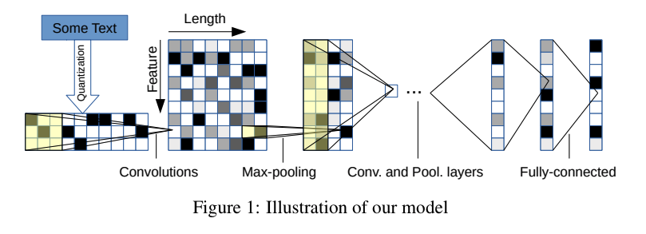

**This is an automated Markdown generation from the notebook '[Crepe-Gluon.ipynb](https://github.com/ThomasDelteil/CNN_NLP_MXNet/blob/master/Crepe-Gluon.ipynb)'**

Check the live demo [here]!(https://thomasdelteil.github.io/TextClassificationCNNs_MXNet/)

Slides available [here](https://www.slideshare.net/ThomasDelteil1/convolutional-neural-networks-and-natural-language-processing-90539354)

Recordings available here, [part1](https://www.youtube.com/watch?v=RgIa3_BjGyk), [part2](https://www.youtube.com/watch?v=mN15vKIyfoA), [part3](https://www.youtube.com/watch?v=K120xBnY6OA).

# Character-level Convolutional Networks for text Classification

## Crepe model implementation with MXNet/Gluon


This is an implementation of [the crepe model, Character-level Convolutional Networks for Text Classification](https://arxiv.org/abs/1509.01626). That this is the paper we reference throughout the tutorial

We are going to perform a **text classification** task, trying to classify Amazon reviews according to the product category they belong to.

This work is inspired from a previous collaborative work with [Ilia Karmanov and Miguel Fierro](https://github.com/ilkarman/NLP-Sentiment)

## Install Guide
You need to install [Apache MXNet](http://mxnet.incubator.apache.org/) in order to run this tutorial. The following lines should work in most platform but checkout the [Apache install](http://mxnet.incubator.apache.org/install/index.html) guide for more info, especially if you plan to use GPU


```python
# GPU install
!pip install mxnet-cu90 pandas -q
# CPU install
#!pip install mxnet pandas -q
```

## Data download
The dataset has been made available on this website: http://jmcauley.ucsd.edu/data/amazon/, citation of relevant papers:

**Ups and downs: Modeling the visual evolution of fashion trends with one-class collaborative filtering**
R. He, J. McAuley
*WWW*, 2016

**Image-based recommendations on styles and substitutes**
J. McAuley, C. Targett, J. Shi, A. van den Hengel
*SIGIR*, 2015


We are downloading a subset of the reviews, the k-core reviews, where k=5. That means that for each category, the dataset has been trimmed to only contain 5 reviews per individual product, and 5 reviews per user.


```python
base_url = 'http://snap.stanford.edu/data/amazon/productGraph/categoryFiles/'
prefix = 'reviews_'
suffix = '_5.json.gz'
folder = 'data'
categories = [
    'Home_and_Kitchen', ""
    'Books', 
    'CDs_and_Vinyl', 
    'Movies_and_TV', 
    'Cell_Phones_and_Accessories',
    'Sports_and_Outdoors', 
    'Clothing_Shoes_and_Jewelry'
]
!mkdir -p $folder
for category in categories:
    print(category)
    url = base_url+prefix+category+suffix
    !wget -P $folder $url -nc -nv
```

    Home_and_Kitchen
    Books
    CDs_and_Vinyl
    Movies_and_TV
    Cell_Phones_and_Accessories
    Sports_and_Outdoors
    Clothing_Shoes_and_Jewelry


## Data Pre-processing
We need to perform some pre-processing steps in order to have the data in a format we can use for training (**X**,**Y**)
In order to speed up training and balance the dataset we will only use a subset of reviews for each category.

### Load the data in memory


```python
MAX_ITEMS_PER_CATEGORY = 250000
```

Helper functions to read from the .json.gzip files


```python
import pandas as pd
import gzip

def parse(path):
    g = gzip.open(path, 'rb')
    for line in g:
        yield eval(line)

def get_dataframe(path, num_lines):
    i = 0
    df = {}
    for d in parse(path):
        if i > num_lines:
            break
        df[i] = d
        i += 1

    return pd.DataFrame.from_dict(df, orient='index')
```

    /home/ec2-user/anaconda3/lib/python3.6/site-packages/matplotlib/__init__.py:962: UserWarning: Duplicate key in file "/home/ec2-user/.config/matplotlib/matplotlibrc", line #2
      (fname, cnt))
    /home/ec2-user/anaconda3/lib/python3.6/site-packages/matplotlib/__init__.py:962: UserWarning: Duplicate key in file "/home/ec2-user/.config/matplotlib/matplotlibrc", line #3
      (fname, cnt))


For each category we load MAX_ITEMS_PER_CATEGORY by randomly sampling the files and shuffling


```python
# Loading data from file if exist
try:
    data = pd.read_pickle('pickleddata.pkl')
except:
    data = None
```

If the data is not available in the pickled file, we create it from scratch


```python
if data is None:
    data = pd.DataFrame(data={'X':[],'Y':[]})
    for index, category in enumerate(categories):
        df = get_dataframe("{}/{}{}{}".format(folder, prefix, category, suffix), MAX_ITEMS_PER_CATEGORY)    
        # Each review's summary is prepended to the main review text
        df = pd.DataFrame(data={'X':(df['summary']+' | '+df['reviewText'])[:MAX_ITEMS_PER_CATEGORY],'Y':index})
        data = data.append(df)
        print('{}:{} reviews'.format(category, len(df)))

    # Shuffle the samples
    data = data.sample(frac=1)
    data.reset_index(drop=True, inplace=True)
    # Saving the data in a pickled file
    pd.to_pickle(data, 'pickleddata.pkl')
```

Let's visualize the data:


```python
print('Value counts:\n',data['Y'].value_counts())
for i,cat in enumerate(categories):
    print(i, cat)
data.head()
```

    Value counts:
     1.0    250000
    6.0    250000
    5.0    250000
    3.0    250000
    2.0    250000
    0.0    250000
    4.0    194439
    Name: Y, dtype: int64
    0 Home_and_Kitchen
    1 Books
    2 CDs_and_Vinyl
    3 Movies_and_TV
    4 Cell_Phones_and_Accessories
    5 Sports_and_Outdoors
    6 Clothing_Shoes_and_Jewelry


<div>
<table border="1" class="dataframe">
  <thead>
    <tr style="text-align: right;">
      <th></th>
      <th>X</th>
      <th>Y</th>
    </tr>
  </thead>
  <tbody>
    <tr>
      <th>0</th>
      <td>Why didnt I find this sooner!!! | This product...</td>
      <td>0.0</td>
    </tr>
    <tr>
      <th>1</th>
      <td>The only thing weighing it down is the second ...</td>
      <td>2.0</td>
    </tr>
    <tr>
      <th>2</th>
      <td>Good | Works very good with a patch pulled or ...</td>
      <td>5.0</td>
    </tr>
    <tr>
      <th>3</th>
      <td>Good mirror glasses | These are very reflectiv...</td>
      <td>6.0</td>
    </tr>
    <tr>
      <th>4</th>
      <td>cute, cushy, too small :( | Well, here's anoth...</td>
      <td>6.0</td>
    </tr>
  </tbody>
</table>
</div>


### Creating the dataset


```python
import mxnet as mx
from mxnet import nd, autograd, gluon
from mxnet.gluon.data import ArrayDataset
from mxnet.gluon.data import DataLoader
import numpy as np
import multiprocessing
```

    /home/ec2-user/anaconda3/lib/python3.6/site-packages/urllib3/contrib/pyopenssl.py:46: DeprecationWarning: OpenSSL.rand is deprecated - you should use os.urandom instead
      import OpenSSL.SSL


Setting up the parameters for the network


```python
ALPHABET = list("abcdefghijklmnopqrstuvwxyz0123456789-,;.!?:'\"/\\|_@#$%^&*~`+ =<>()[]{}") # The 69 characters as specified in the paper
ALPHABET_INDEX = {letter: index for index, letter in enumerate(ALPHABET)} # { a: 0, b: 1, etc}
FEATURE_LEN = 1014 # max-length in characters for one document
NUM_WORKERS = multiprocessing.cpu_count() # number of workers used in the data loading
BATCH_SIZE = 128 # number of documents per batch
```

According to the paper, each document needs to be encoded in the following manner:
    - Truncate to 1014 characters
    - Reverse the string
    - One-hot encode based on the alphabet
    
The following `encode` function does this for us


```python
def encode(text):
    encoded = np.zeros([len(ALPHABET), FEATURE_LEN], dtype='float32')
    review = text.lower()[:FEATURE_LEN-1:-1]
    i = 0
    for letter in text:
        if i >= FEATURE_LEN:
            break;
        if letter in ALPHABET_INDEX:
            encoded[ALPHABET_INDEX[letter]][i] = 1
        i += 1
    return encoded
```

The MXNet DataSet and DataLoader API lets you create different worker to pre-fetch the data and encode it the way you want, in order to prevent your GPU from starving


```python
class AmazonDataSet(ArrayDataset):
    # We pre-process the documents on the fly
    def __getitem__(self, idx):
        return encode(self._data[0][idx]), self._data[1][idx]
```

We split our data into a training and a testing dataset


```python
split = 0.8
split_index = int(split*len(data))
train_data_X = data['X'][:split_index].as_matrix()
train_data_Y = data['Y'][:split_index].as_matrix()
test_data_X = data['X'][split_index:].as_matrix()
test_data_Y = data['Y'][split_index:].as_matrix()
train_dataset = AmazonDataSet(train_data_X, train_data_Y)
test_dataset = AmazonDataSet(test_data_X, test_data_Y)
```

Creating the training and testing dataloader, with NUM_WORKERS set to the number of CPU core


```python
train_dataloader = DataLoader(train_dataset, shuffle=True, batch_size=BATCH_SIZE, num_workers=NUM_WORKERS, last_batch='discard')
```


```python
test_dataloader = DataLoader(test_dataset, shuffle=True, batch_size=BATCH_SIZE, num_workers=NUM_WORKERS, last_batch='discard')
```

## Creation of the network

The context will define where the training takes place, on the CPU or on the GPU


```python
# ctx = mx.cpu()
ctx = mx.gpu() # to run on GPU
```

We create the network following the instructions describe in the paper, using the small feature and small output units configuration




Based on the paper we set the following parameters:


```python
NUM_FILTERS = 256 # number of convolutional filters per convolutional layer
NUM_OUTPUTS = len(categories) # number of classes
FULLY_CONNECTED = 1024 # number of unit in the fully connected dense layer
DROPOUT_RATE = 0.5 # probability of node drop out
LEARNING_RATE = 0.01 # learning rate of the gradient
MOMENTUM = 0.9 # momentum of the gradient
WDECAY = 0.00001 # regularization term to limit size of weights
```


```python
net = gluon.nn.HybridSequential()
with net.name_scope():
    net.add(gluon.nn.Conv1D(channels=NUM_FILTERS, kernel_size=7, activation='relu'))
    net.add(gluon.nn.MaxPool1D(pool_size=3, strides=3))
    net.add(gluon.nn.Conv1D(channels=NUM_FILTERS, kernel_size=7, activation='relu'))
    net.add(gluon.nn.MaxPool1D(pool_size=3, strides=3))
    net.add(gluon.nn.Conv1D(channels=NUM_FILTERS, kernel_size=3, activation='relu'))
    net.add(gluon.nn.Conv1D(channels=NUM_FILTERS, kernel_size=3, activation='relu'))
    net.add(gluon.nn.Conv1D(channels=NUM_FILTERS, kernel_size=3, activation='relu'))
    net.add(gluon.nn.Conv1D(channels=NUM_FILTERS, kernel_size=3, activation='relu'))
    net.add(gluon.nn.MaxPool1D(pool_size=3, strides=3))
    net.add(gluon.nn.Flatten())
    net.add(gluon.nn.Dense(FULLY_CONNECTED, activation='relu'))
    net.add(gluon.nn.Dropout(DROPOUT_RATE))
    net.add(gluon.nn.Dense(FULLY_CONNECTED, activation='relu'))
    net.add(gluon.nn.Dropout(DROPOUT_RATE))
    net.add(gluon.nn.Dense(NUM_OUTPUTS))

```


```python
print(net)
```

    HybridSequential(
      (0): Conv1D(None -> 256, kernel_size=(7,), stride=(1,))
      (1): MaxPool1D(size=(3,), stride=(3,), padding=(0,), ceil_mode=False)
      (2): Conv1D(None -> 256, kernel_size=(7,), stride=(1,))
      (3): MaxPool1D(size=(3,), stride=(3,), padding=(0,), ceil_mode=False)
      (4): Conv1D(None -> 256, kernel_size=(3,), stride=(1,))
      (5): Conv1D(None -> 256, kernel_size=(3,), stride=(1,))
      (6): Conv1D(None -> 256, kernel_size=(3,), stride=(1,))
      (7): Conv1D(None -> 256, kernel_size=(3,), stride=(1,))
      (8): MaxPool1D(size=(3,), stride=(3,), padding=(0,), ceil_mode=False)
      (9): Flatten
      (10): Dense(None -> 1024, Activation(relu))
      (11): Dropout(p = 0.5)
      (12): Dense(None -> 1024, Activation(relu))
      (13): Dropout(p = 0.5)
      (14): Dense(None -> 7, linear)
    )


Here we define whether we load a pre-trained version of the model and [hybridize the network](https://mxnet.incubator.apache.org/tutorials/gluon/hybrid.html) for speed improvements


```python
hybridize = True # for speed improvement, compile the network but no in-depth debugging possible
load_params = True # Load pre-trained model
```

### Parameter initialization


```python
if load_params:
    net.load_params('crepe_gluon_epoch6.params', ctx=ctx)
else:
    net.collect_params().initialize(mx.init.Xavier(magnitude=2.24), ctx=ctx)
```

### Hybridization


```python
if hybridize:
    net.hybridize()
```

### Softmax cross-entropy Loss

We are in a multi-class classification problem, so we use the [Softmax Cross entropy loss](https://deepnotes.io/softmax-crossentropy)


```python
softmax_cross_entropy = gluon.loss.SoftmaxCrossEntropyLoss()
```

### Optimizer


```python
trainer = gluon.Trainer(net.collect_params(), 'sgd', 
                        {'learning_rate': LEARNING_RATE, 
                         'wd':WDECAY, 
                         'momentum':MOMENTUM})
```

### Evaluate Accuracy


```python
def evaluate_accuracy(data_iterator, net):
    acc = mx.metric.Accuracy()
    for i, (data, label) in enumerate(data_iterator):
        data = data.as_in_context(ctx)
        label = label.as_in_context(ctx)
        output = net(data)
        prediction = nd.argmax(output, axis=1)

        if (i%50 == 0):
            print("Samples {}".format(i*len(data)))
        acc.update(preds=prediction, labels=label)
    return acc.get()[1]
```

### Training Loop
We loop through the batches given by the data_loader. These batches have been asynchronously fetched by the workers.

After an epoch, we measure the test_accuracy and save the parameters of the model


```python
start_epoch = 6
number_epochs = 7
smoothing_constant = .01
for e in range(start_epoch, number_epochs):
    for i, (review, label) in enumerate(train_dataloader):
        review = review.as_in_context(ctx)
        label = label.as_in_context(ctx)
        with autograd.record():
            output = net(review)
            loss = softmax_cross_entropy(output, label)
        loss.backward()
        trainer.step(review.shape[0])
        
        # moving average of the loss
        curr_loss = nd.mean(loss).asscalar()
        moving_loss = (curr_loss if (i == 0) 
                       else (1 - smoothing_constant) * moving_loss + (smoothing_constant) * curr_loss)

        if (i%50 == 0):
            nd.waitall()
            print('Batch {}:{},{}'.format(i,curr_loss,moving_loss))

    test_accuracy = evaluate_accuracy(test_dataloader, net)
    #Save the model using the gluon params format
    net.save_params('crepe_epoch_{}_test_acc_{}.params'.format(e,int(test_accuracy*10000)/100))
    print("Epoch %s. Loss: %s, Test_acc %s" % (e, moving_loss, test_accuracy))
```

### Export to the symbolic format
The `save_params()` method works for models trained in Gluon. 

However the `export()` function, exports it to a format usable in the symbolic API.
We need the symbolic API in order to make it compatible with the current version of MXNet Model Server, for deployment purposes


```python
net.export('model/crepe')
```

### Random testing

Let's randomly pick a few reviews and see how the classifier does!


```python
import random
index = random.randint(1, len(data))
review = data['X'][index]
label = categories[int(data['Y'][index])]
print(review)
print('\nCategory: {}\n'.format(label))
encoded = nd.array([encode(review)], ctx=ctx)
output = net(encoded)
predicted = categories[np.argmax(output[0].asnumpy())]
if predicted == label:
      print('Correct')
else:
      print('Incorrectly predicted {}'.format(predicted))
```

    Fine Breadmaker | We have used this mainly for the standard and whole wheat modes.  Their recipes work fine; also fine with Pamela's bread mix.
    
    Category: Home_and_Kitchen
    
    Correct


### Manual Testing
We can also write our own reviews, encode them and see what the model predicts


```python
review_title = "Good stuff"
review = "This album is definitely better than the previous one"
```


```python
print(review_title)
print(review + '\n')
encoded = nd.array([encode(review + " | " + review_title)], ctx=ctx)
output = net(encoded)
softmax = nd.exp(output) / nd.sum(nd.exp(output))[0]
predicted = categories[np.argmax(output[0].asnumpy())]
print('Predicted: {}\n'.format(predicted))
for i, val in enumerate(categories):
    print(val, float(int(softmax[0][i].asnumpy()*1000)/10), '%')
```

    Good stuff
    This album is definitely better than the previous one
    
    Predicted: CDs_and_Vinyl
    
    Home_and_Kitchen 0.0 %
    Books 0.0 %
    CDs_and_Vinyl 98.7 %
    Movies_and_TV 0.8 %
    Cell_Phones_and_Accessories 0.2 %
    Sports_and_Outdoors 0.1 %
    Clothing_Shoes_and_Jewelry 0.0 %


# Model Deployment

Head over to the `model/` folder and have a look at the README.md to learn how you can deploy this pre-trained model to MXNet Model Server. You can then package the API in a docker container for cloud deployment!

An interactive live demo is available [here](https://thomasdelteil.github.io/TextClassificationCNNs_MXNet/)

[](https://thomasdelteil.github.io/TextClassificationCNNs_MXNet/)

